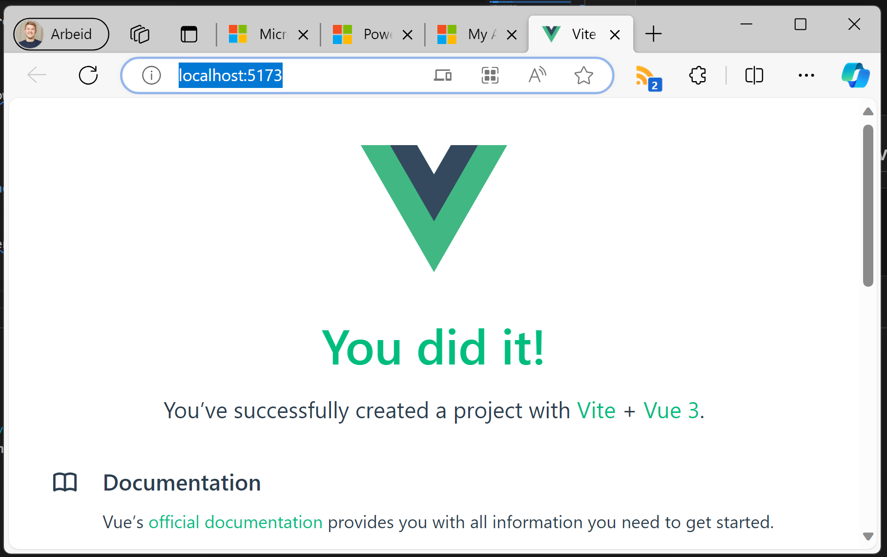

# Step 1: Creating the Vue.js project

## Scaffolding the Vue.js project

To quickly setup a project we use the create-vue tool.

Drop down to your favorite shell and run: ```npm create vue@latest```.

Please note that I've added Pinia for future state management.

```PS
> npm create vue@latest

Need to install the following packages:
  create-vue@3.8.0
Ok to proceed? (y)

Vue.js - The Progressive JavaScript Framework

√ Project name: ... vue-in-powerpages
√ Add TypeScript? ... No / Yes
√ Add JSX Support? ... No / Yes
√ Add Vue Router for Single Page Application development? ... No / Yes
√ Add Pinia for state management? ... No / Yes
√ Add Vitest for Unit Testing? ... No / Yes
√ Add an End-to-End Testing Solution? » No
√ Add ESLint for code quality? ... No / Yes

Scaffolding project in C:\repos\Vuejs-in-PowerPages\vue-in-powerpages...

Done. Now run:

  cd vue-in-powerpages
  npm install
  npm run dev
```

## Starting the developer server

``` PS
cd vue-in-powerpages
npm install
npm run dev
```

The server should now start, and you can open your browser at http://localhost:5173/


Pat yourself on the back! You did it! Your first app is up and running!