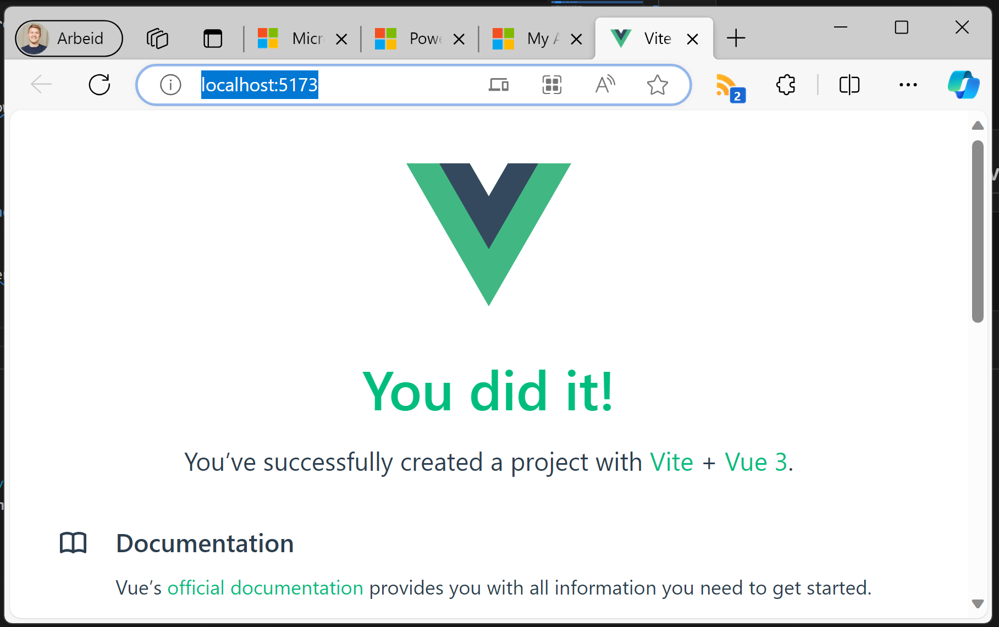
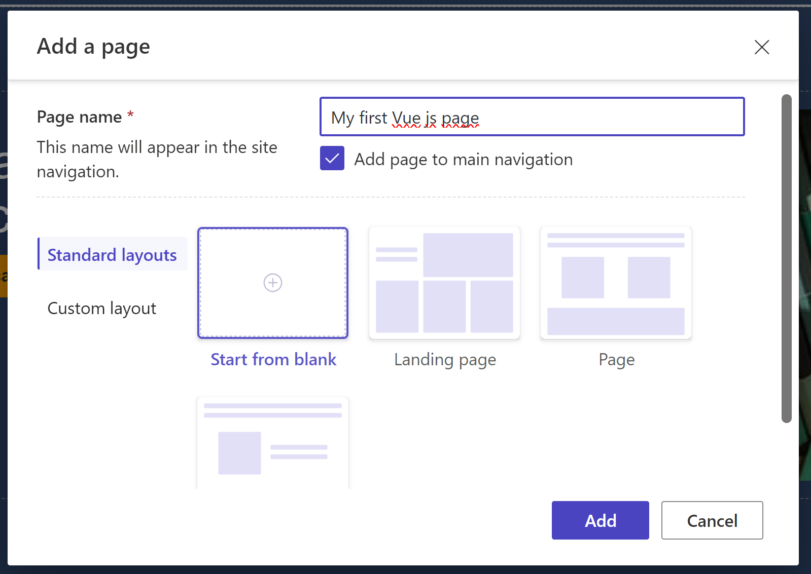
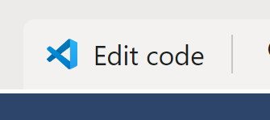
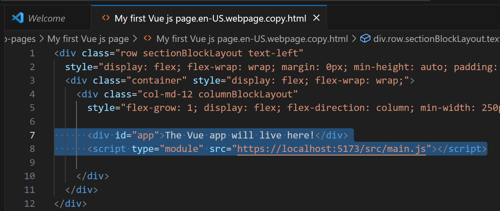
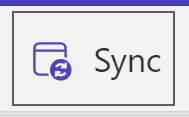
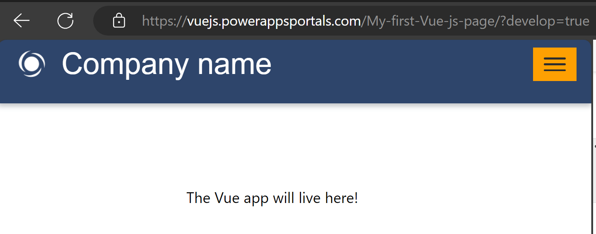
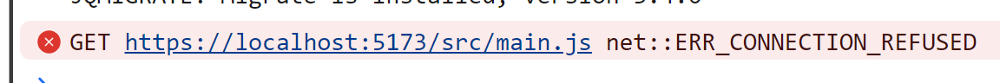
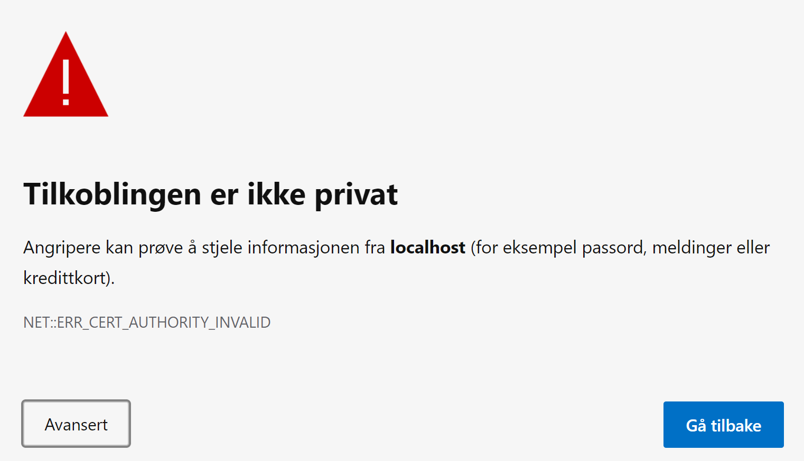
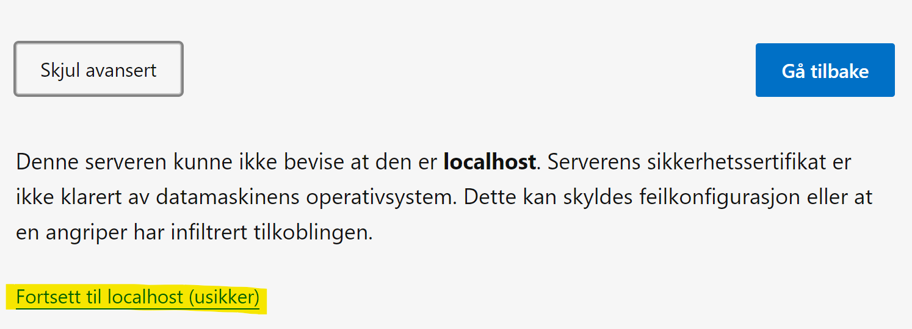
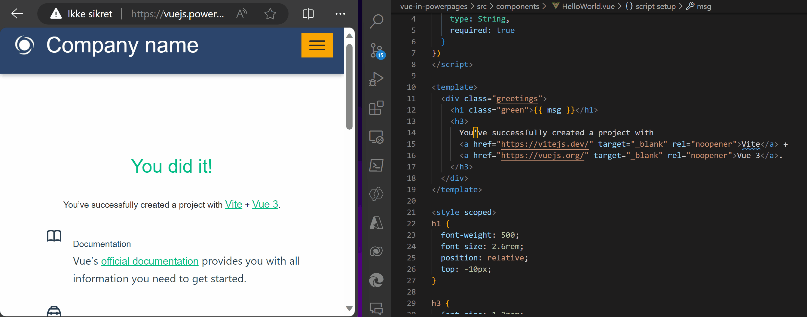

# Getting started with Power Pages + Vue.js

# Step 1: Creating the Vue.js project

## Scaffolding the Vue.js project

To quickly setup a project we use the create-vue tool.

Drop down to your favorite shell and run: ```npm create vue@latest```.

Please note that I've added Pinia for future state management.

```PS
> npm create vue@latest

Need to install the following packages:
  create-vue@3.8.0
Ok to proceed? (y)

Vue.js - The Progressive JavaScript Framework

√ Project name: ... vue-in-powerpages
√ Add TypeScript? ... No / Yes
√ Add JSX Support? ... No / Yes
√ Add Vue Router for Single Page Application development? ... No / Yes
√ Add Pinia for state management? ... No / Yes
√ Add Vitest for Unit Testing? ... No / Yes
√ Add an End-to-End Testing Solution? » No
√ Add ESLint for code quality? ... No / Yes

Scaffolding project in C:\repos\Vuejs-in-PowerPages\vue-in-powerpages...

Done. Now run:

  cd vue-in-powerpages
  npm install
  npm run dev
```

## Starting the developer server

``` PS
cd vue-in-powerpages
npm install
npm run dev
```

The server should now start, and you can open your browser at http://localhost:5173/


Pat yourself on the back! You did it! Your first app is up and running!

# Step 2: Adding the app to Power Pages
The next steps requires some more work, both in Power Pages and in the Vue.js app.

## Power Pages

### Add a page

We'll start in Power Pages by creating a new page for the component to live on:


Once the page is created we'll open it in Visual Studio to add some customizations:


Here we'll add a div fot the app and load the script from localhost:


```HTML
<div id="app">The Vue app will live here!</div>
<script type="module" src="https://localhost:5173/src/main.js"></script>
```

Save the file, head back to Portals Studio and remember to Sync before previewing the page.


You should now see the placeholder div on the page, but unfortunately it wont load before we make some changes to the Vue app.




## Adapting the Vue app for Power Pages

As stated above we need to make some adjustment before the app can be loaded in Power Pages.

### Turn on HTTPS

Power Pages runs on HTTPS, while the local development server now uses HTTP. To prevent your browser from blocking the app, it's necessary to enable HTTPS on the local server.

To enable https we first need to install the [vite plugin basic ssl](./img/https://github.com/vitejs/vite-plugin-basic-ssl):
```PS
> cd vue-in-powerpages
> npm install --save-dev @vitejs/plugin-basic-ssl
```

We then need to add it to the vite.config.js:
```Javascript
import { fileURLToPath, URL } from 'node:url'
import basicSsl from '@vitejs/plugin-basic-ssl' // Load basic SSL plugin
import { defineConfig } from 'vite'
import vue from '@vitejs/plugin-vue'

export default defineConfig({
  server: {
    https: true // Enable HTTPS for the server
  },
  plugins: [
    vue(),
    basicSsl() // Use basic SSL plugin for HTTPS
  ],
  resolve: {
    alias: {
      '@': fileURLToPath(new URL('./src', import.meta.url))
    }
  }
})
```

## Opening the Vue app in Power Pages


Starting the dev server - it should now be listening on HTTPS:
```PS
> npm run dev
VITE v4.5.0  ready in 701 ms

  ➜  Local:   https://localhost:5173/
```

Opening https://localhost:5173/ will now yield a warning that you need to accept:




You should now be able reload the page we created in Power Pages and load the app.

And as if that wasn't enough you should now be able to do live editing of the Vue app and instantly see the changes on save!


Once again, pat your self on the back! Well done! 